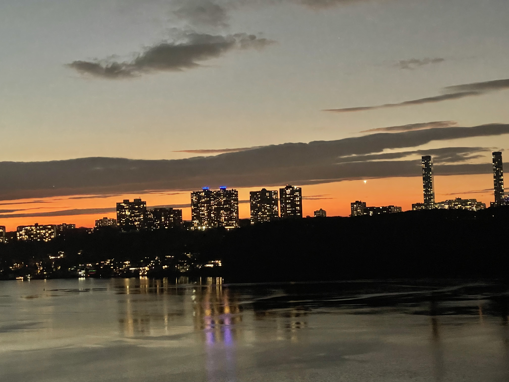
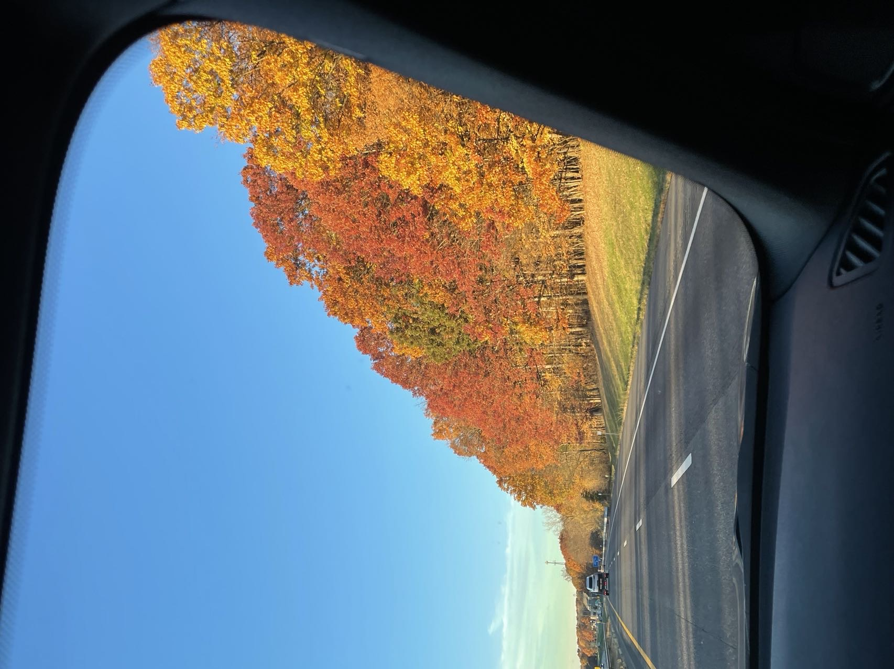
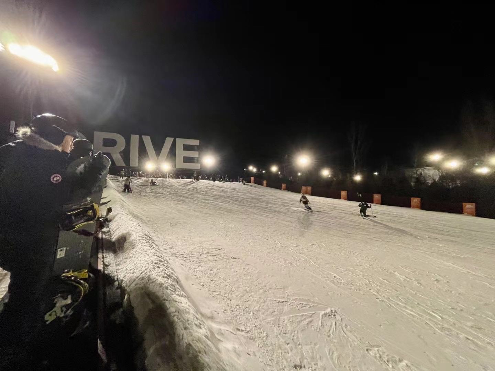

# Here is REN XIN's awesome website, Welcome!!
   

   
   

   This is the photo I took out of my window yesterday. It's very beautiful, and I wanna share with you.

# Introduction
Name:XIN REN

Hobby：Hiking、Fencing and skiing.

There are some photo I took
   

   
   

   

   This photo was taken when I went on a trip last week.
   

   

   
   

   

   This is me in the process of fencing training!
   

   

   
   

   

   This is a photo I took at a snow park in China.
   

# Education bandground
Columbia University    ——New York

MS in Biostatistics

Stony Brook University ——New York

Bachelor of Economics

# Experience
Gome Holdings Group   ——Beijing, China

Intern and then Investment Analyst (Private Equity/Venture Capital)

1.Probed deeply into the sectors, e.g., cross-border e-commerce, assisted reproduction, oversea power
  bank sharing, and social audio, covering interviews, supply-and-demand analysis, business mode
  research, competitive analysis, financial analysis, valuation, and so on.
  
2.Assisted Investment Director/Manager in the daily affairs of private equity, e.g., fund-raising,
  investing, management, and exiting.
  
3.Completed 30 industry reports, 50 meeting minutes, and 20 post-investment reports

PricewaterhouseCoopers Information Technologies Co., Ltd   ——Shanghai, China

Assistant   

1.Conducted data analysis on dietary supplement and coffee markets, to complete two excellent strategic
reports.

2.Developed familiarity with internet in data consolidation and data organization.

3.Learned to interpret the industries by data and to make data-based predictions.

4.Handled some urgent problems and communicated with different teams.

5.Made reviews and feedback to the mentor on a regular basis.

# Others

Here's some text. I like the internet. I use [google](https://www.google.com/)all the time to do data science.

Here is a direct link to the about page:[about](about.html)

I also made a bonus:[extra page](extra_page.html)

##[Here's](plotly.html) a page with plotly plots.

